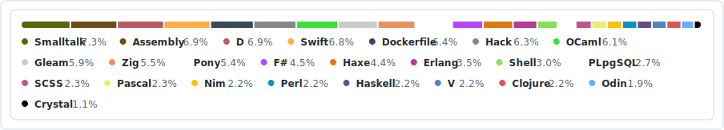

Solving AOC 2024 using a different language each day.
Docker is used to run each program so I don't have to make a mess out of my host environment.

Each program will read from stdin and display the answers in stdout. Ideally, the program handles the entirety of the IO cycle; however, for some languages like Sass, some preprocessing is mandatory.

Day 7: Scratch is not runnable through the usual run script. See the README in the Scratch folder for details.

Full language breakdown, minus Inko and Scratch

## Roadmap

**Languages that didn't make the cut:** Ring, Hylo, Vale, Groovy, PHP, Ruby, Oberon, Jai, Wren, Lua

1. Odin
2. Sass (SCSS)
3. NASM (x64)
4. PostgreSQL
5. Fish
6. Perl
7. Scratch
8. Zig
9. F#
10. Clojure
11. V
12. GNU Smalltalk
13. Pascal (FPC)
14. Erlang
15. Swift
16. D (DMD)
17. Hack
18. Inko
19. Pony
20. Haxe
21. Gleam
22. Haskell
23. Nim
24. OCaml
25. Crystal
